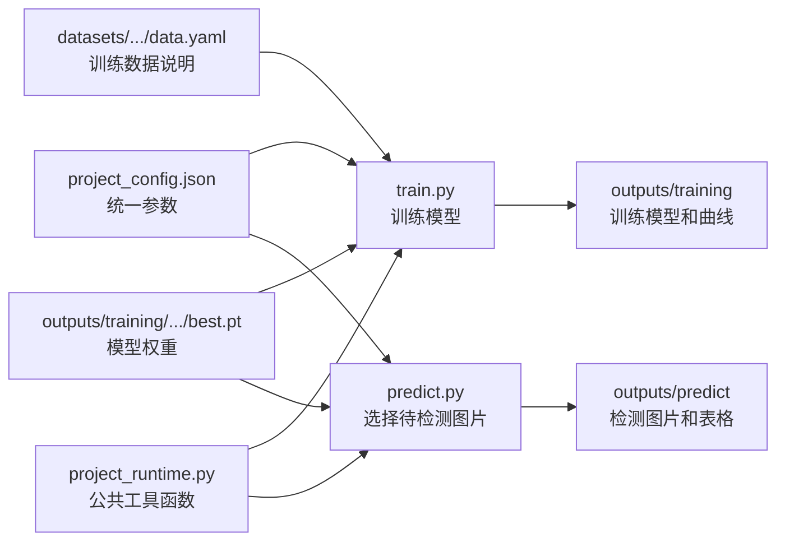
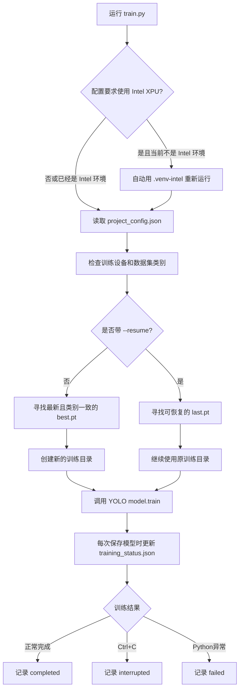
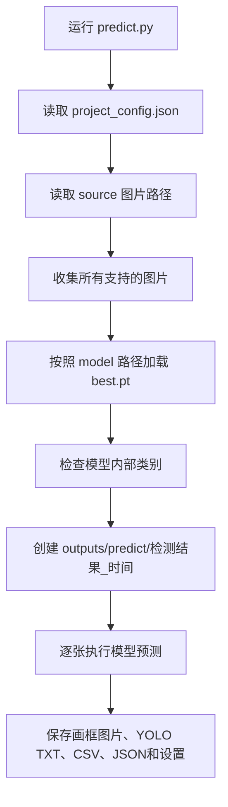

# train.py 与 predict.py 初学者详解

本文对应当前项目：

```text
C:\Users\intco\Desktop\英科文件\2-丁二手模残缺检测\D2_cljc
```

当前模型检测三类缺陷：

| 编号 | 英文名称 | 中文含义 |
| --- | --- | --- |
| 0 | residue | 残料 |
| 1 | crack | 裂纹 |
| 2 | undemolded | 未脱模 |

## 一、先理解这几个文件之间的关系



可以把它们理解成：

- `project_config.json` 是项目的“设置面板”。
- `train.py` 是“学习程序”，让模型根据训练图片不断调整参数。
- `predict.py` 是“检测入口”，安排模型检测哪些图片。
- `project_runtime.py` 是“工具箱”，提供加载模型、检测图片、保存结果等公共功能。
- `best.pt` 是训练得到的“知识文件”，真正学到的特征和参数保存在里面。

## 二、train.py 的整体执行顺序



## 三、train.py 分段讲解

### 1. 导入基础工具

```python
from pathlib import Path
from datetime import datetime
import argparse
import json
import sys
import subprocess
```

这些并不训练模型，作用如下：

- `Path`：处理文件夹和文件路径。
- `datetime`：给每次训练目录加上时间，防止覆盖上次结果。
- `argparse`：读取命令参数，例如 `--resume`。
- `json`：读取 `project_config.json`。
- `sys`：获取当前正在使用的 Python，以及用户输入的命令参数。
- `subprocess`：使用另一个 Python 环境重新运行程序。

### 2. 找到项目根目录

```python
ROOT = Path(__file__).resolve().parent
```

`__file__` 是当前 `train.py` 的位置，`.parent` 是它所在的文件夹。因此 `ROOT` 就是项目根目录。

后续写：

```python
ROOT / "project_config.json"
```

就表示项目根目录中的 `project_config.json`。使用这种写法后，不需要把完整的 `C:\Users\...` 路径写死在每一处代码里。

### 3. 自动切换到 Intel 训练环境

第8至25行先读取配置中的训练设备：

```python
training_device = "xpu:0"
```

如果要求使用 Intel 显卡，但当前运行的不是 `.venv-intel`，程序就执行：

```python
subprocess.call([Intel环境的python, train.py, 原命令参数])
```

这相当于程序发现“当前工具不对”，自动换成支持 Intel 显卡的 Python，再从头执行一次。

这段代码必须写在：

```python
import torch
from ultralytics import YOLO
```

之前。因为普通 `.venv` 安装的是 CPU 版 PyTorch，`.venv-intel` 安装的是 XPU 版 PyTorch。PyTorch 一旦导入，再更换解释器已经来不及。

### 4. 导入训练库和项目公共函数

```python
import torch
from ultralytics import YOLO
from project_runtime import config, dataset, write_json
```

- `torch` 是深度学习计算基础，负责张量、梯度和硬件加速。
- `YOLO` 提供模型加载、训练、验证和预测功能。
- `config()` 读取统一配置。
- `dataset()` 检查数据集配置和类别顺序。
- `write_json()` 安全保存训练状态。

Ultralytics YOLO 是上层训练框架，真正大量的数值计算由 PyTorch 完成。

### 5. `_weight_candidates(filename)`：查找历史模型

```python
(ROOT / "outputs" / "training").rglob(filename)
```

它会递归查找所有正式训练目录中的指定文件。例如：

- `_weight_candidates("best.pt")` 查找所有最佳模型。
- `_weight_candidates("last.pt")` 查找所有最近检查点。

然后按照文件最后修改时间倒序排列，最新文件放在前面。

这里的“最新”只表示保存时间最近，并不表示它的准确率一定是所有历史模型里最高。

### 6. `_model_names(weight)`：读取模型类别

```python
model = YOLO(str(weight))
return [model.names[i] for i in range(len(model.names))]
```

模型文件内部保存了类别名称。这段函数读取它们，用于防止把旧类别模型误用到当前三类任务。

例如当前配置是：

```python
["residue", "crack", "undemolded"]
```

如果某个旧模型内部还是四类或包含 `stain`，程序会跳过它。

### 7. `select_training_start(cfg)`：决定新训练从哪个模型开始

普通运行：

```powershell
.\.venv-intel\Scripts\python.exe .\train.py
```

会进入这个函数。选择顺序是：

1. 搜索 `outputs/training` 中的所有 `best.pt`。
2. 从最新文件开始检查。
3. 选择第一个类别完全一致的 `best.pt`。
4. 如果一个可用的历史模型都没有，就使用配置中的 `weights/yolo26s.pt`。

因此，普通运行表示“开一次新的训练”，只是用已有最佳权重作为学习起点。轮数从 `1/88` 重新显示是正常的。

### 8. `select_resume_checkpoint(cfg)`：决定从哪个断点续训

运行：

```powershell
.\.venv-intel\Scripts\python.exe .\train.py --resume
```

会进入这个函数。它查找 `last.pt`，并要求同时满足：

- 对应任务状态是 `interrupted` 或 `failed`。
- 模型类别与当前配置一致。
- 检查点中存在有效轮数。
- 检查点中存在优化器状态。

`last.pt` 不只保存模型参数，还保存当时的训练轮数、优化器动量和学习率进度，所以能从中断位置继续。

`best.pt` 适合检测和作为新训练起点，`last.pt` 适合断点续训。

### 9. `configure_intel_optimizer(trainer)`：Intel 兼容处理

当前 Intel 环境曾在 AdamW 批量更新参数时出现资源错误，因此代码设置：

```python
foreach = False
fused = False
```

可以把它理解为：优化器原本想把很多参数合成一批交给显卡更新，现在改为更保守的逐组更新方式。

这不会丢掉已经保存的学习率、动量和训练步数，但有可能牺牲一点速度来换取兼容性。

只有设备是 `xpu` 且优化器是 Adam 或 AdamW 时，这段处理才生效。

### 10. `main()`：训练总入口

文件最下面的：

```python
if __name__ == "__main__":
    main()
```

意思是：当你直接运行 `train.py` 时，执行 `main()`。

如果其他文件只是导入 `train.py` 中的函数，就不会自动开始训练。

### 11. 读取命令参数

代码支持两个参数：

```text
--check-device    只检查训练设备，不训练
--resume          从最近的有效 last.pt 继续训练
```

例子：

```powershell
.\.venv\Scripts\python.exe .\train.py --check-device
```

程序会显示 Intel 显卡型号和 PyTorch 版本，然后结束。

### 12. 读取训练设备

```python
device = cfg.get("training_device", cfg["device"])
```

意思是优先使用 `training_device`；如果旧配置没有这个字段，再使用 `device`。

当前配置为：

```json
"device": "cpu",
"training_device": "xpu:0"
```

所以：

- 训练使用 Intel 显卡。
- 预测和评估仍使用 CPU。

### 13. 检查 Intel 显卡是否真的可用

```python
torch.xpu.is_available()
```

只看到显卡名称还不够，代码又执行了一次很小的显卡运算并等待它完成：

```python
torch.empty(1, device=device).add_(1)
torch.xpu.synchronize()
```

如果驱动或 XPU 环境不可用，程序会在正式训练前报错。

### 14. 检查数据集

```python
data, _ = dataset(dict(cfg, data=str(data)))
```

公共函数会检查：

- `data.yaml` 是否存在。
- 数据集类别是否等于当前三类。
- 类别顺序是否一致。

类别顺序非常重要。YOLO 标签中的第一列是数字，例如 `0`。如果类别顺序改变，数字 `0` 的含义也会改变。

### 15. 新训练和断点续训的区别

新训练会新建目录：

```text
outputs/training/模型训练_年月日_时分秒_微秒/
```

断点续训继续使用原来的训练目录，因为它属于同一次训练任务。

| 操作 | 使用权重 | 轮数 | 优化器状态 | 输出目录 |
| --- | --- | --- | --- | --- |
| 直接运行 `train.py` | 最新合格 `best.pt` | 从1开始 | 重新建立 | 新目录 |
| `train.py --resume` | 最近可续训 `last.pt` | 从保存轮数继续 | 恢复 | 原目录 |

### 16. `record()`：保存训练状态

程序保存两份状态：

```text
本次训练目录/training_status.json
outputs/last_training.json
```

常见字段：

| 字段 | 含义 |
| --- | --- |
| status | starting、running、completed、interrupted 或 failed |
| data | 本次使用的 data.yaml |
| training_start | 从哪个 `.pt` 开始 |
| last_saved_epoch | 已完整保存到第几轮 |
| best | 当前最佳模型路径 |
| last | 最近检查点路径 |
| device | 使用的训练设备 |
| torch_version | PyTorch版本 |

YOLO 每次保存模型时会触发：

```python
model.add_callback("on_model_save", ...)
```

然后调用 `record("running", trainer)` 更新状态。

### 17. 创建 YOLO 模型

```python
model = YOLO(str(training_start))
```

这里不是从零创建一个空模型，而是读取一个已有 `.pt` 文件作为起点。

模型可以理解为一个包含很多可调数字的计算系统。训练时，程序反复执行：

1. 把一批图片送进模型。
2. 模型预测缺陷类别和位置。
3. 与人工标注比较，计算损失 `loss`。
4. PyTorch 计算每个模型参数应该往哪个方向调整。
5. AdamW 优化器更新模型参数。
6. 完成所有训练图片后，算一轮 `epoch`。
7. 使用验证集检查这一轮的效果。
8. 保存 `last.pt`，效果最好时更新 `best.pt`。

### 18. `model.train()` 中每个参数的含义

当前新训练使用：

| 参数 | 当前值 | 通俗解释 |
| --- | --- | --- |
| data | 配置中的 data.yaml | 训练集和验证集在哪里、类别是什么 |
| epochs | 88 | 最多把训练集完整学习88遍 |
| patience | 30 | 验证效果连续30轮没有改善时提前停止 |
| imgsz | 640 | 输入模型前缩放到约640像素尺度 |
| batch | 4 | 每次一起处理4张图片 |
| device | xpu:0 | 使用第一块 Intel GPU |
| workers | 0 | 主进程读取数据，适合当前 Windows 环境 |
| seed | 42 | 固定随机数，尽量让实验可重复 |
| optimizer | AdamW | 决定如何依据梯度更新模型参数 |
| lr0 | 0.001 | 初始学习率，可理解为每次调整的基本步幅 |
| nbs | batch | 用于标定损失和权重衰减的名义批量大小 |
| mosaic | 0.25 | 部分训练图片使用拼图增强 |
| close_mosaic | 10 | 最后10轮关闭拼图增强 |
| scale | 0.2 | 随机缩放增强范围 |
| fliplr | 0.0 | 不做左右翻转 |
| flipud | 0.0 | 不做上下翻转 |
| amp | False | 不使用自动混合精度 |
| plots | True | 保存训练曲线、混淆矩阵等图片 |

这些参数只有在“新训练”时从 `project_config.json` 和代码中读取。断点续训主要恢复原检查点保存的参数，代码会另外覆盖设备为当前 `training_device`。

### 19. 三种结束情况

正常完成：

```python
record("completed", model.trainer)
```

用户按 `Ctrl+C`：

```python
except KeyboardInterrupt:
    record("interrupted", ...)
```

可由 `--resume` 继续。

Python 能捕获的其他错误：

```python
except Exception as exc:
    record("failed", ...)
```

底层显卡驱动直接终止 Python 进程时，Python 有时来不及执行这段异常处理，所以状态可能残留为 `running`。

## 四、训练输出怎么看

训练目录大致如下：

```text
outputs/training/模型训练_.../
├── weights/
│   ├── best.pt          验证效果最好的模型
│   └── last.pt          最近完成一轮后的完整检查点
├── results.csv          每轮损失和指标
├── results.png          训练曲线
├── confusion_matrix.png 混淆矩阵
├── args.yaml            YOLO实际使用的参数
├── training_status.json 项目自己的状态记录
└── project_config_snapshot.json 本次开始时的配置快照
```

`best.pt` 并不是每轮都生成一个新文件名，而是当验证效果刷新最佳值时覆盖同一个 `best.pt`。

`last.pt` 通常在每轮结束后更新，保存最近一次完整状态。

## 五、predict.py 的整体执行顺序



## 六、predict.py 逐段讲解

### 1. 为什么 predict.py 很短

```python
from project_runtime import ROOT, EXT, config, load_model, output_dir, run_prediction
```

`predict.py` 只组织检测流程，重复使用的复杂功能放在 `project_runtime.py`。这样 `evaluate.py` 也能调用完全相同的检测逻辑，避免两个程序的阈值或处理方式不一致。

### 2. 读取配置和图片来源

```python
cfg = config()
source = ROOT / cfg["source"]
```

当前配置：

```json
"source": "test_images"
```

所以程序检测：

```text
D2_cljc/test_images
```

`source` 也可以指向单张图片。

### 3. 收集待检测图片

```python
paths = [source] if source是图片 else 遍历source目录
```

支持的后缀由 `EXT` 定义：

```text
.jpg .jpeg .png .bmp .tif .tiff
```

程序会递归查找子目录，并排序后逐张检测。目录不存在或没有支持的图片时，会直接报出明确错误。

### 4. 加载哪个模型

```python
model = load_model(cfg)
```

`load_model()` 在 `project_runtime.py` 中，它读取：

```json
"model": "outputs/training/.../weights/best.pt"
```

然后检查：

- 模型文件是否存在。
- 模型内部类别是否与配置一致。

需要特别注意：`train.py` 自动寻找最新 `best.pt` 作为下一次训练起点，但当前代码不会自动修改配置中的 `model`。因此训练结束后，如果想让 `predict.py` 使用新模型，需要把 `project_config.json` 的 `model` 改成新训练目录里的 `weights/best.pt`。

### 5. 创建预测输出目录

```python
output = output_dir("predict", "检测结果_")
```

会创建：

```text
outputs/predict/检测结果_年月日_时分秒_微秒/
```

每次运行使用新目录，不会覆盖上一次结果。

### 6. 真正开始检测

```python
run_prediction(cfg, model, paths, output, relative_root)
```

检测和保存的主体在 `project_runtime.py`，下面继续解释。

## 七、project_runtime.py 中与预测有关的代码

### 1. `config()`：读取并检查阈值

它读取 `project_config.json`，并要求：

```text
0 <= conf <= 1
0 <= iou <= 1
```

- `conf` 是置信度门槛。低于这个值的框不输出。
- `iou` 在预测时用于 NMS 去除高度重叠的重复框。

当前是：

```json
"conf": 0.25,
"iou": 0.3
```

`conf` 越高，输出框通常越少，误检可能减少，漏检可能增加。`iou` 并不是模型准确率，它主要控制重叠框去重的程度。

### 2. `load_model(cfg)`：加载并核对模型

```python
p = ROOT / cfg["model"]
model = YOLO(str(p))
```

加载后比较 `model.names` 与 `cfg["names"]`。这可以阻止类别数量相同但含义不同的旧模型被误用。

### 3. `output_dir()`：建立唯一结果目录

时间精确到微秒，所以连续运行两次也几乎不会重名。`exist_ok=False` 表示如果目录意外重名，就报错而不是覆盖已有结果。

### 4. `snapshot(cfg)`：记录这次检测使用了什么

除了完整配置，还记录：

- 模型的完整路径。
- 模型文件的 SHA256 指纹。
- 本次预测处理方式说明。

SHA256 可以理解为文件的“数字指纹”。即使两个模型都叫 `best.pt`，只要内容不同，指纹通常就不同。

### 5. `predict_one()`：单张图片的核心检测

```python
model.predict(
    source=图片,
    imgsz=640,
    conf=0.25,
    iou=0.3,
    device="cpu",
    rect=False,
)
```

各参数来自当前配置：

| 参数 | 作用 |
| --- | --- |
| source | 当前图片文件 |
| imgsz | 输入模型的图片尺寸 |
| conf | 置信度阈值 |
| iou | NMS重叠框去重参数 |
| device | 预测设备；当前是CPU |
| rect=False | 每张图片按统一方形尺寸处理 |
| save=False | 不让YOLO自行决定保存目录 |
| verbose=False | 不输出YOLO的大量逐图日志 |

函数末尾的 `[0]` 表示输入只有一张图片，取预测结果列表中的第一个结果。

### 6. 模型如何从图片得到检测框

简化理解如下：

1. 图片被缩放并转换成数字张量。
2. 模型多层网络提取边缘、纹理、形状和缺陷特征。
3. 模型产生很多候选框、类别分数和位置。
4. 删除置信度低于 `conf` 的候选框。
5. NMS 根据 `iou` 删除重复框。
6. 得到最终的 `result.boxes`。

每个最终框通常包含：

```text
x1, y1, x2, y2, confidence, class_id
```

即左上角、右下角坐标，置信度和类别编号。

### 7. `run_prediction()`：逐张预测并保存

程序先写入：

```text
settings.json
```

然后对每一张图片执行 `predict_one()`。

画框图片由：

```python
result.save(filename=str(dest))
```

生成。框、类别名称、置信度的默认绘制由 Ultralytics 完成，当前项目没有自己用 OpenCV 手动画框。

预测框文本由：

```python
result.save_txt(str(label), save_conf=True)
```

生成。每行一般是：

```text
类别编号 中心x 中心y 宽度 高度 置信度
```

坐标通常是相对于图片宽高归一化后的0到1数值。

如果图片没有检测框，程序仍创建一个空 TXT。这样可以明确表示“这张图已经检测，只是没有结果”。

### 8. 每类框数量如何统计

```python
int((result.boxes.cls == i).sum())
```

例如 `i=0` 时，统计所有类别编号为0的框，也就是残料框数量。

### 9. 为什么每处理一张图就 `flush()`

```python
f.flush()
```

它要求系统尽快把 CSV 内容写入文件。即使中途报错，前面已经处理的图片记录也更容易保留下来。

同时 `finally` 会尽量写出 `detections.json`，保存已经完成的部分结果。

## 八、预测结果目录包含什么

```text
outputs/predict/检测结果_.../
├── images/             已画检测框的图片
├── labels/             每张图片的预测框TXT
├── summary.csv         每张图片各类框数量与推理时间
├── detections.json     所有框的原始数值和速度
└── settings.json       本次模型、阈值和配置快照
```

`summary.csv` 适合直接查看和筛选；`detections.json` 适合以后由程序继续分析。

## 九、最容易混淆的五件事

### 1. `pretrained`、`model`、`best.pt` 和 `last.pt`

| 名称 | 用在哪里 |
| --- | --- |
| pretrained | 没有合格历史模型时，作为训练起点 |
| model | `predict.py` 和 `evaluate.py` 当前实际加载的模型 |
| best.pt | 某次训练中验证效果最好的权重，适合检测和新训练起点 |
| last.pt | 最近一轮的完整训练检查点，适合 `--resume` |

### 2. 新训练与续训

- 直接运行：建立新任务，从当前最佳权重继续学习，轮数从1显示。
- 加 `--resume`：恢复同一任务的轮数、优化器和学习率进度。

### 3. 训练设备与预测设备

当前：

```json
"training_device": "xpu:0",
"device": "cpu"
```

所以终端训练显示 Intel GPU，运行 `predict.py` 时仍显示 CPU 是正常的。

### 4. 训练轮数多不等于模型一定更好

训练轮数增加能让模型继续调整，但数据少、标注不一致或类别不平衡时，也可能过拟合。最终应使用固定测试集指标和现场图片判断。

### 5. `best.pt` 不是自动投入预测

新训练产生新 `best.pt` 后，先评估它，再决定是否修改 `project_config.json` 的 `model`。这样旧模型不会在未经比较时被自动替换。

## 十、你日常最常用的操作

检查 Intel 设备：

```powershell
.\.venv\Scripts\python.exe .\train.py --check-device
```

开始一次新训练：

```powershell
.\.venv-intel\Scripts\python.exe .\train.py
```

中断后续训：

```powershell
.\.venv-intel\Scripts\python.exe .\train.py --resume
```

检测 `test_images`：

```powershell
.\.venv\Scripts\python.exe .\predict.py
```

如果训练仍在运行，先不要再次启动另一个训练程序。检查 `outputs/last_training.json` 中的 `status` 和 `last_saved_epoch`，可以知道最近一次保存状态。
